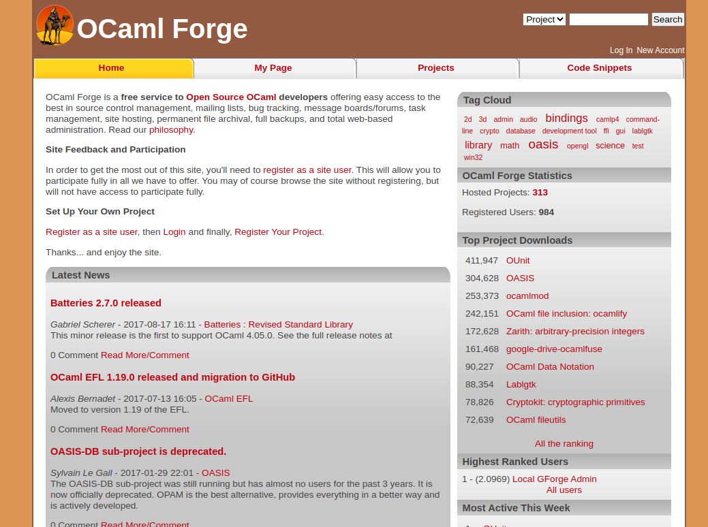

<!-- ((! set title forge.ocamlcore.org 2008-2020 !)) -->

# forge.ocamlcore.org 2008-2020

The OCaml Forge was setup in 2008 by a few administrators to increase the visibility of OCaml projects and provide them
with a common infrastructure. At this time, Github was not yet very popular and the other options did not offer the type
of visibility for OCaml we wanted. When the forge was shutdown, there were 416 users and 300 projects hosted. 

## Building the forge
 
The main goal was to provide an infrastructure for the OCaml community:

- Make more visible OCaml enthusiasts
- Allow to gather an important code base
- Centralize contribution to gain more momentum
- Improve the OCaml “marketing” by showing many projects and libraries available
  
When the forge was built, the market was different. The main code hosting sites were SourceForge and Google Code. They 
were other contenders like Savannah and self-hosting possibility with Trac. The team behind the forge has decided
to use FusiongForge, which was an open-source fork of the SourceForge code base. It was a great platform, offering most
of what was needed.  

## Operating the forge
 
The forge was offering:
- Mailing list (mailman)
- File upload/download
- Planet style RSS feed (tracking many OCaml blogs)
- Project Sites
- Bug Tracking
- VCS (bzr, mercurial, git, cvs, subversion)

The administrators of the website were: 

* Sylvain Le Gall
* Romain Beauxis
* Pietro Abate
* Stéphane Glondu
* Stefano Zacchiroli
 
The biggest projects, in terms of downloads, in 2018 were:
 
1. [OASIS](https://github.com/ocaml/oasis)
1. [OUnit](https://github.com/gildor478/ounit)
1. [Zarith](https://github.com/ocaml/Zarith)
1. [google-drive-ocamlfuse](https://github.com/astrada/google-drive-ocamlfuse)
1. [Lablgtk](https://github.com/garrigue/lablgtk)
1. [Cryptokit](https://github.com/xavierleroy/cryptokit)
1. [OCaml fileutils](https://github.com/gildor478/ocaml-fileutils)
 		
The forge has also hosted a lot of other great OCaml projects: 
* [Batteries](https://github.com/ocaml-batteries-team/batteries-included)
* [ExtUnix](https://ygrek.org/p/ocaml-extunix/)
* [LablTk](https://github.com/garrigue/labltk)
* calendar
* ...

## Decision to close the forge.
 
Given the rise of Github and the lack of time to maintain the OCaml Forge, the main administrator decided to deprecate
the forge in 2017 ([announcement](https://forge.ocamlcore.org/deprecation_announcement/)). The amount of time needed
to maintain the forge was not worth the number of active projects. The forge was under constant attacks (e.g. SSH
attacks) and was often used as SEO platform (hosting small "link farm" in artifacts).  

### Timeline

- 2008-01-30: team started to work right after year OCaml Meeting 2008
- 2008-02-10: document to made clear the distinction between OCamlCore.com (main sponsor) and the forge
- 2008-02-19: planet.o.o online
- 2008-03-07: forge.o.o enter beta test
- 2008-03-20: darcs.o.o and git.o.o (2 VCS popular in 2008)
- 2008-04-19: the forge is officially opened
- 2008-09-02: homepage for projects (Project Sites, like http://oasis.forge.ocamlcore.org)
- 2009-01-31: 114 users, 72 projects
- 2010-04-16: 244 users, 146 projects
- 2011-04-15: 390 users, 221 projects
- 2011-10-20: plans drafted to migrate to forge.ocaml.org (never delivered)
- 2014-10-23: the forge has been compromised!
- 2016-09-04: significant increase in SSH attacks, more restrictions on SSH put in place
- 2016-09-09: planet.o.o is deprecated in favor of ocaml.org
- 2016-12-30: official announce of the forge deprecation.
- 2020-10-17: 416 users, 300 projects, 1.2k files (tarballs of projects)
- 2020-10-17: the final day of the forge, which is now replaced with a static website