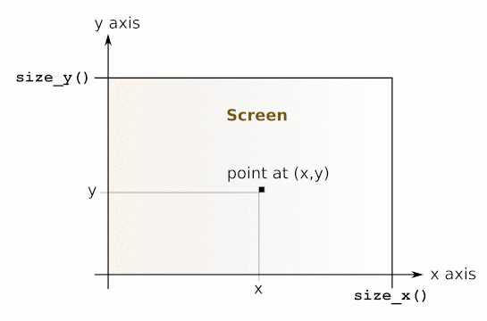

<!-- ((! set title Manual !)) ((! set documentation !)) ((! set manual !)) ((! set nobreadcrumb !)) -->

<ul class="part_menu"><li><a href="manual034.html">The core library</a></li><li><a href="manual035.html">The standard library</a></li><li><a href="manual036.html">The unix library: Unix system calls</a></li><li><a href="manual037.html">The num library: arbitrary-precision rational arithmetic</a></li><li><a href="manual038.html">The str library: regular expressions and string processing</a></li><li><a href="manual039.html">The threads library</a></li><li class="active"><a href="manual040.html">The graphics library</a></li><li><a href="manual041.html">The dynlink library: dynamic loading and linking of object files</a></li><li><a href="manual042.html">The LablTk library: Tcl/Tk GUI interface</a></li><li><a href="manual043.html">The bigarray library</a></li></ul><header><nav class="toc brand"></nav><nav class="toc">
<a href="/docs" id="version-select">Version 4.00</a>

<a href="#">The graphics library</a>
</nav></header>

<h1 class="chapter"><a name="htoc304">Chapter 26</a>&nbsp;&nbsp;The graphics library</h1>
The <tt>graphics</tt> library provides a set of portable drawing primitives.
Drawing takes place
in a separate window that is created when <tt>Graphics.open_graph</tt> is called.
<blockquote class="quote">Unix:&nbsp;&nbsp;
This library is implemented under the X11 windows system. 
Programs that use the <tt>graphics</tt> library must be linked as follows:
<pre>        ocamlc <i>other options</i> graphics.cma <i>other files</i>
</pre>
For interactive use of the <tt>graphics</tt> library, do:
<pre>        ocamlmktop -o mytop graphics.cma
        ./mytop
</pre>
or (if dynamic linking of C libraries is supported on your platform),
start <tt>ocaml</tt> and type <tt>#load "graphics.cma";;</tt>.
Here are the graphics mode specifications supported by
<tt>Graphics.open_graph</tt> on
the X11 implementation of this library:
the argument to <tt>Graphics.open_graph</tt> has the format
<tt>"</tt><i>display-name geometry</i><tt>"</tt>,
where <i>display-name</i> is the name of the X-windows display to
connect to, and <i>geometry</i> is a standard X-windows geometry
specification. The two components are separated by a space. Either can
be omitted, or both. Examples:

<dl class="description"><dt class="dt-description">
<b><tt>Graphics.open_graph "foo:0"</tt></b></dt><dd class="dd-description">
connects to the display <tt>foo:0</tt> and creates a window with the default geometry
</dd><dt class="dt-description"><b><tt>Graphics.open_graph "foo:0 300x100+50-0"</tt></b></dt><dd class="dd-description">
connects to the display <tt>foo:0</tt> and creates a window 300 pixels wide
by 100 pixels tall, at location (50,0)
</dd><dt class="dt-description"><b><tt>Graphics.open_graph " 300x100+50-0"</tt></b></dt><dd class="dd-description">
connects to the default display and creates a window 300 pixels wide
by 100 pixels tall, at location (50,0)
</dd><dt class="dt-description"><b><tt>Graphics.open_graph ""</tt></b></dt><dd class="dd-description">
connects to the default display and creates a window with the default
geometry.
</dd></dl></blockquote><blockquote class="quote">Windows:&nbsp;&nbsp;
This library is available both for standalone compiled programs and
under the toplevel application <tt>ocamlwin.exe</tt>. For the latter, this
library must be loaded in-core by typing
<pre>        #load "graphics.cma";;
</pre></blockquote>
The screen coordinates are interpreted as shown in the figure below.
Notice that the coordinate system used is the same as in mathematics:
<i>y</i> increases from the bottom of the screen to the top of the screen,
and angles are measured counterclockwise (in degrees).
Drawing is clipped to the screen.

<ul class="ftoc2"><li class="li-links">
<a href="../../api/4.00/Graphics.html">Module <tt>Graphics</tt>: machine-independent graphics primitives</a>
</li></ul>

The present documentation is copyright Institut National de Recherche en Informatique et en Automatique (INRIA). A complete version can be obtained from <a href="http://caml.inria.fr/pub/docs/manual-ocaml/">this page</a>.

