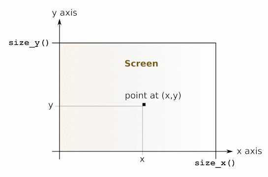

<!-- ((! set title Manual !)) ((! set documentation !)) ((! set manual !)) ((! set nobreadcrumb !)) -->

<ul class="part_menu"><li><a href="core.html">The core library</a></li><li><a href="stdlib.html">The standard library</a></li><li><a href="parsing.html">The compiler front-end</a></li><li><a href="libunix.html">The unix library: Unix system calls</a></li><li><a href="libnum.html">The num library: arbitrary-precision rational arithmetic</a></li><li><a href="libstr.html">The str library: regular expressions and string processing</a></li><li><a href="libthreads.html">The threads library</a></li><li class="active"><a href="libgraph.html">The graphics library</a></li><li><a href="libdynlink.html">The dynlink library: dynamic loading and linking of object files</a></li><li><a href="libbigarray.html">The bigarray library</a></li></ul><header><nav class="toc brand"></nav><nav class="toc">
<a href="/docs" id="version-select">Version 4.07</a>

<a href="#">The graphics library</a>
</nav></header>

<h1 class="chapter" id="sec564">Chapter 32&nbsp;&nbsp;The graphics library</h1>

The graphics library provides a set of portable drawing primitives.
Drawing takes place
in a separate window that is created when Graphics.open_graph is called.
<blockquote class="quote">Unix:&nbsp;&nbsp;
This library is implemented under the X11 windows system. 
Programs that use the graphics library must be linked as follows:
<pre>        ocamlc other options graphics.cma other files
</pre>
For interactive use of the graphics library, do:
<pre>        ocamlmktop -o mytop graphics.cma
        ./mytop
</pre>
or (if dynamic linking of C libraries is supported on your platform),
start ocaml and type #load "graphics.cma";;.
Here are the graphics mode specifications supported by
Graphics.open_graph on
the X11 implementation of this library:
the argument to Graphics.open_graph has the format
"display-name geometry",
where display-name is the name of the X-windows display to
connect to, and geometry is a standard X-windows geometry
specification. The two components are separated by a space. Either can
be omitted, or both. Examples:

<dl class="description"><dt class="dt-description">
Graphics.open_graph "foo:0"</dt><dd class="dd-description">
connects to the display foo:0 and creates a window with the default geometry
</dd><dt class="dt-description">Graphics.open_graph "foo:0 300x100+50-0"</dt><dd class="dd-description">
connects to the display foo:0 and creates a window 300 pixels wide
by 100 pixels tall, at location (50,0)
</dd><dt class="dt-description">Graphics.open_graph " 300x100+50-0"</dt><dd class="dd-description">
connects to the default display and creates a window 300 pixels wide
by 100 pixels tall, at location (50,0)
</dd><dt class="dt-description">Graphics.open_graph ""</dt><dd class="dd-description">
connects to the default display and creates a window with the default
geometry.
</dd></dl></blockquote><blockquote class="quote">Windows:&nbsp;&nbsp;
This library is available both for standalone compiled programs and
under the toplevel application ocamlwin.exe. For the latter, this
library must be loaded in-core by typing
<pre>        #load "graphics.cma";;
</pre></blockquote>
The screen coordinates are interpreted as shown in the figure below.
Notice that the coordinate system used is the same as in mathematics:
y increases from the bottom of the screen to the top of the screen,
and angles are measured counterclockwise (in degrees).
Drawing is clipped to the screen.

<ul class="ftoc2"><li class="li-links">
<a href="../../api/4.07/Graphics.html">Module Graphics: machine-independent graphics primitives</a>
</li></ul>

The present documentation is copyright Institut National de Recherche en Informatique et en Automatique (INRIA). A complete version can be obtained from <a href="http://caml.inria.fr/pub/docs/manual-ocaml/">this page</a>.

